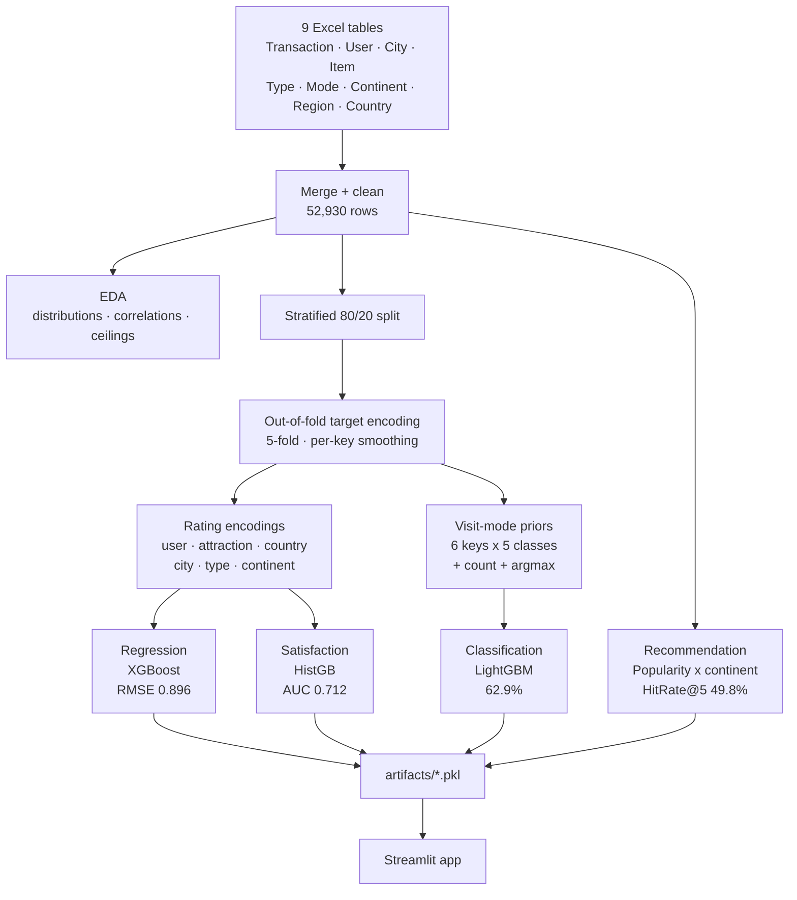

<div align="center">

# 🌍 Tourism Experience Analytics

**Predicting traveller behaviour, satisfaction and attraction preference from 52,930 real tourism transactions.**

[](https://github.com/Ankit-builds1/tourism-experience-analytics/actions/workflows/ci.yml)
[](https://www.python.org/)
[](https://scikit-learn.org/)
[](https://lightgbm.readthedocs.io/)
[](https://xgboost.readthedocs.io/)
[](https://streamlit.io/)
[](LICENSE)

*A regression, classification and recommendation system — built with leakage-free target encoding, honest baselines, and a documented account of what did **not** work.*

</div>

---

## Why this repo is worth reading

Most ML project repos report only the numbers that look good. This one reports the **baseline next to every metric**, documents a subtle target-leakage bug that made gradient boosting score *worse than random*, and includes a model that was **built, tested and rejected** with a diagnosis.

Three findings that only surfaced because the baselines were there:

| Claim that looked fine | What the baseline revealed |
|---|---|
| "Satisfaction model: 78.9% accuracy" | Majority baseline is **also** 78.9% — the model predicted one class for all 10,585 rows and had ROC-AUC **0.48** |
| "Rating prediction within ±1 star: 78.7%" | A constant-mean predictor scores **78.9%** — the metric measures class imbalance, not the model |
| "Collaborative filtering recommender" | Scored **0.167** against a random baseline of **0.167** — indistinguishable from shuffling the catalogue |

All three were caught, diagnosed, and fixed or removed. Full write-up: **[docs/METHODOLOGY.md](docs/METHODOLOGY.md)**.

---

## Results

Every metric is reported against its own baseline. No metric is quoted that merely reproduces the base rate.

### 🎯 Task 1 — Visit-mode classification *(5 classes)*

| Model | Accuracy | Top-2 | F1 (weighted) | F1 (macro) |
|---|---|---|---|---|
| **LightGBM** | **62.90%** | **81.56%** | **0.615** | **0.538** |
| HistGradientBoosting | 62.80% | 81.53% | 0.613 | 0.535 |
| LogReg + HGB ensemble | 62.71% | 81.17% | 0.611 | 0.534 |
| XGBoost | 62.65% | 81.76% | 0.611 | 0.535 |
| Random Forest | 62.37% | 80.86% | 0.606 | 0.509 |
| Logistic Regression | 61.99% | 80.74% | 0.603 | 0.524 |
| *Majority baseline* | *40.85%* | *69.60%* | — | — |

> **+22.1 points over baseline.** Six independent model families land within **0.91 points** of each other — the signature of an *information* limit, not a tuning limit. The ceiling is derived arithmetically below.

### ⭐ Task 2 — Rating regression *(1–5 stars)*

| Model | RMSE | MAE | R² |
|---|---|---|---|
| **XGBoost** | **0.8961** | **0.6977** | **0.1448** |
| HistGradientBoosting | 0.8983 | 0.7000 | 0.1405 |
| Random Forest | 0.9040 | 0.7062 | 0.1296 |
| Ridge | 0.9101 | 0.7117 | 0.1178 |
| Linear Regression | 0.9101 | 0.7117 | 0.1177 |
| *Baseline (train mean)* | *0.9690* | *0.7604* | *0.0000* |

> **7.5% error reduction.** R² = 0.145 looks low until the ceiling is measured: a variance decomposition of within-user rating spread (0.696) against global variance (0.942) caps a *perfect* user model at **R² ≈ 0.26**. This model captures **56% of the achievable signal**.

### 😀 Task 2b — Dissatisfaction risk *(binary, Rating ≥ 4)*

| Metric | Value | Baseline |
|---|---|---|
| **ROC-AUC** | **0.7123** | 0.500 |
| Recall on dissatisfied @ t=0.50 | 0.61 | — |
| Precision on dissatisfied | 0.34 | 0.211 base rate → **1.6× lift** |
| Accuracy @ accuracy-optimal t=0.25 | 79.60% | 78.87% |

> The threshold is exposed as a **business decision**, not fixed at 0.5. A low threshold catches more unhappy visits for service recovery at the cost of false alarms.

### 💡 Task 3 — Recommendation *(top-5)*

| Recommender | HitRate@5 | MAP@5 | Verdict |
|---|---|---|---|
| **Popularity by continent** | **49.78%** | **0.310** | ✅ deployed |
| Blend (pop 2.0 / geo 0.5 / CF 0.0) | 49.69% | 0.290 | tuner zeroed CF |
| Popularity (global) | 49.36% | 0.243 | un-personalised |
| Popularity by country | 49.11% | 0.304 | over-fragmented (153 groups) |
| Content-based (TF-IDF) | 30.25% | 0.103 | ❌ |
| Item-item CF | 29.02% | 0.101 | ❌ |
| SVD (12 factors) | 28.93% | 0.101 | ❌ |
| CF (damped user mean) | 16.71% | 0.059 | ❌ **= random (16.7%)** |

> **3.0× random.** Continent conditioning barely moves hit rate (+0.4 pts) but improves **MAP@5 by 27%** — with a 30-item catalogue, personalisation changes the *order*, not the *candidates*.

---

## The dataset — and why it constrains everything

Nine relational tables joined on 52,930 transactions. The interesting facts are the awkward ones:

| Property | Value | Consequence |
|---|---|---|
| Transactions | 52,930 raw → 52,922 after cleaning | — |
| Unique users | 33,530 | — |
| **Users with exactly one transaction** | **22,912 (68%)** | no history to learn from |
| **Distinct attractions in transactions** | **30** (catalogue has 1,698) | tiny recommendation space |
| User-item matrix density | **4.30%** | collaborative filtering starves |
| Ratings ≥ 4 | 79% | accuracy is a misleading metric |
| Visit-mode split | Couples 40.9% … Business 1.2% | 34× class imbalance |
| Repeat users keeping the same visit mode | **85%** | the single strongest signal |

### The accuracy ceiling, derived

The feature carrying the classifier is the user's own visit history. Measured on the test split:

| Row group | Share | Best achievable | Contribution |
|---|---|---|---|
| Has user history | 51% | 0.78 *(prior alone is 0.75)* | 0.398 |
| No user history | 49% | ~0.47 *(best demographic cell is 51.4%)* | 0.230 |
| | | **Predicted ceiling** | **≈ 0.628** |

**Measured best model: 0.6290.** The model sits *exactly* on the ceiling implied by its own feature diagnostics. That is why six model families converge — and why the actionable recommendation is a **product** change, not a modelling one.

---

## Architecture



---

## The methodology detail that matters most

### Leave-one-out encoding leaks the target — backwards

The first version computed each row's attraction-mean rating as `(S - r) / (n - 1)`. Within one attraction, `S` and `n` are constants, so **the encoding is an exactly decreasing linear function of that row's own rating**. Trees that split finely enough read the target off in reverse.

The back-channel scales as `4 / (n - 1)`:

| Attraction | Rows | LOO spread | Exploitable? |
|---|---|---|---|
| ID 640 | ~10,500 | 0.0004 | no |
| ID 928 | ~22 | **0.19** | **yes** — same order as the 1.3 spread *across* attractions |

Result before the fix — the models that should be strongest were the worst:

| Model | R² with LOO | R² with out-of-fold |
|---|---|---|
| XGBoost | **−0.642** | **+0.145** |
| HistGradientBoosting | −0.020 | +0.141 |
| Random Forest | +0.031 | +0.130 |
| Ridge *(immune — absorbs it as one coefficient)* | +0.126 | +0.118 |
| Satisfaction ROC-AUC | **0.482** *(anti-predictive)* | **0.712** |

**Fix:** 5-fold out-of-fold encoding with count smoothing — each row's encoding comes from a *disjoint* set of rows, so no deterministic self-relationship can exist. An automated sign-flip check now runs in the pipeline:

```
Leak check - rating encodings (signs must match, magnitudes should be close):
  user_rt      train=+0.1656  test=+0.1741
  attr_rt      train=+0.3028  test=+0.2884
  type_rt      train=+0.2624  test=+0.2543
```

### Smoothing strength is per-key, not global

Additive smoothing `(counts + m * prior) / (n + m)` mixes `m` imaginary global-average observations into every group. A single `m` for all keys throws away the strongest feature:

| Key | `m` | Why |
|---|---|---|
| `umode` (user) | **1.0** | repeat users are 85% mode-consistent — one visit is strong evidence |
| `amode`, `cmode` | 10.0 | thousands of rows per group, already stable |
| `contmode`, `tmode` | 20.0 | 5 continents / 17 types — huge groups, smooth hard |

With `m = 5` the user prior peaked at 0.51, barely above the 0.41 global rate. With `m = 1` it peaks at **0.664**, matching the measured 85% consistency.

Full write-up: **[docs/METHODOLOGY.md](docs/METHODOLOGY.md)**

---

## Business insights

1. **68% of users appear exactly once — that is the ceiling, not the model.**
   Visit-mode accuracy is capped near 63% because only 51% of predictions can draw on user history. Cross-visit identity tracking would raise coverage toward 100%, which the same arithmetic projects toward **78% accuracy**. Worth more than any model change.

2. **Collaborative filtering is the wrong tool for this catalogue.**
   30 attractions, 4.3% density, 1.3 ratings per user. CF scored at chance. Popularity conditioned on continent is the correct production choice — cheaper to serve and 3× better.

3. **Satisfaction is driven by the attraction, not the visitor.**
   Rating correlates 0.30 with attraction identity and only 0.17 with user identity. Service quality — not visitor mix — determines ratings, so the lowest-rated attractions are the highest-ROI intervention targets.

4. **A deployable service-recovery filter exists today.**
   At threshold 0.50 the model surfaces 61% of visits that will be rated ≤ 3, targeting 1.6× better than random.

---

## Repository layout

```
tourism-experience-analytics/
├── app.py                          # Streamlit application (5 tabs)
├── requirements.txt                # exact pinned versions used to build the artifacts
├── artifacts/                      # the training -> serving handoff boundary
│   ├── visitmode_classifier.pkl    #   LightGBM, 54 features
│   ├── rating_regressor.pkl        #   XGBoost, 22 features
│   ├── satisfaction_classifier.pkl #   HistGradientBoosting
│   ├── aggregates.pkl              #   full-train encodings + smoothing constants
│   ├── lookups.pkl                 #   feature order, class map, config
│   ├── recommender.pkl             #   5 continents x 30 items (not 28,708 x 30)
│   ├── attr_country.pkl            #   attraction -> country, for IsDomestic
│   ├── tourism_clean.csv           #   cleaned dataset (deliverable)
│   └── *_results.csv               #   model comparison tables
├── notebooks/                      # end-to-end training notebook
├── docs/METHODOLOGY.md             # leakage investigation, ceilings, rejected models
├── .streamlit/config.toml          # app theme
└── .github/workflows/ci.yml        # verifies artifacts load on every push
```

---

## Quickstart

```bash
git clone https://github.com/Ankit-builds1/tourism-experience-analytics.git
```

```bash
cd tourism-experience-analytics && python -m venv .venv
```

<details>
<summary><b>Windows PowerShell</b></summary>

```powershell
.\.venv\Scripts\python.exe -m pip install -r requirements.txt
```

```powershell
.\.venv\Scripts\python.exe -m streamlit run app.py
```

*Calling `python.exe` directly avoids PowerShell's execution-policy block on `Activate.ps1`.*
</details>

<details>
<summary><b>macOS / Linux</b></summary>

```bash
source .venv/bin/activate && pip install -r requirements.txt && streamlit run app.py
```
</details>

Opens at `http://localhost:8501`.

> ⚠️ **Use Python 3.12.** The pickles were built under 3.12 with numpy 2.0.2. Prebuilt wheels are per-minor-version — on 3.13+ pip will try to compile numpy from source and fail.

---

## The app

| Tab | What it does |
|---|---|
| 📊 **Dashboard** | Filterable KPIs, visit-mode mix, attraction popularity vs quality, yearly trends |
| 🎯 **Visit Mode** | Predicts Business / Couples / Family / Friends / Solo with class probabilities |
| ⭐ **Rating & Satisfaction** | Predicted star rating plus a dissatisfaction-risk flag at the service-recovery threshold |
| 💡 **Recommendations** | Top-*k* attractions for a new or returning visitor, excluding already-visited |
| 📈 **Model Performance** | Full comparison tables and the documented findings |

Every prediction tab states the model's accuracy **against its baseline**, so the interface is honest about its own limits.

---

## Reproducing from scratch

The notebook in [`notebooks/`](notebooks/) runs end to end on the raw Excel tables:

| Cell | Stage |
|---|---|
| 1–2 | Load 9 tables, repair Excel padding rows and duplicate keys |
| 3–4 | Relational merge, cleaning, feature engineering → `tourism_clean.csv` |
| 5 | EDA — distributions, correlations, the variance decomposition that sets the R² ceiling |
| 6 | **Out-of-fold target encoding** with per-key smoothing + automated leak check |
| 7 | Regression (6 models), satisfaction model, threshold sweep |
| 8 | Classification (6 models) with baseline-relative reporting |
| 9 | Recommendation — CF, SVD, content-based, hybrid, popularity, demographic |
| 10–11 | Artifact export with reload verification, then `app.py` |

---

## Tech stack

`pandas` · `numpy` · `scikit-learn` · `LightGBM` · `XGBoost` · `Streamlit` · `Plotly` · `joblib`

## License

[MIT](LICENSE) © Ankit Dash
